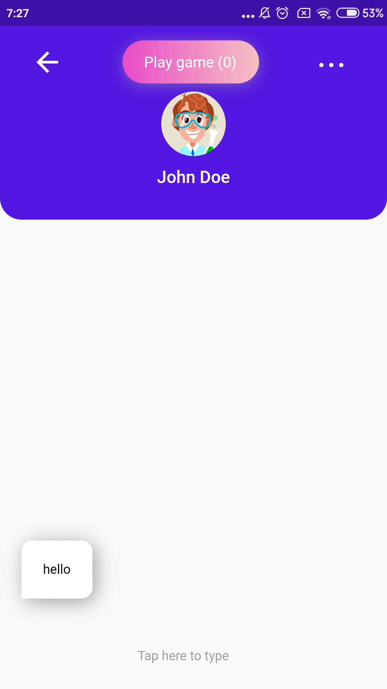
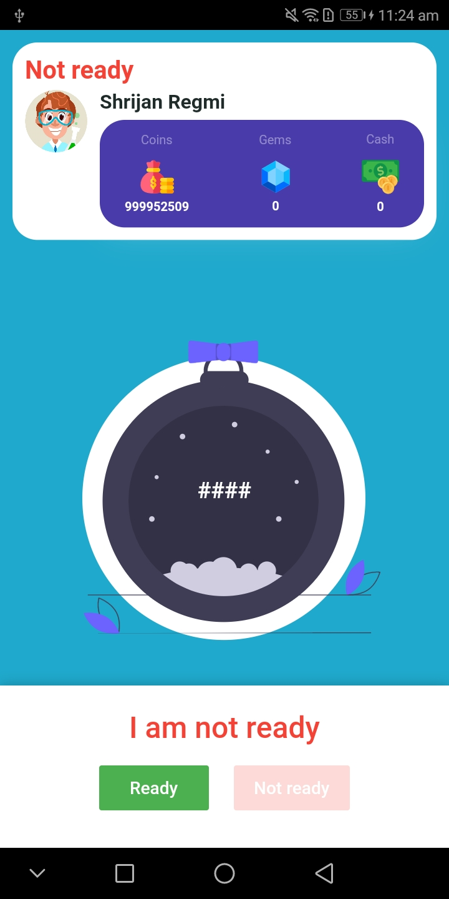

# iprecious

A new Flutter application.

## This app allows the user to play game using your mobile phone's balance (For Ncell and NTC users only).

### To start first create your account

1. Choose a character.

2. Fill all the fields

3. Choose your sim and create the account

### Login to your account, if not already done

### Now in order to play a game there are 3 modes
1. Play with friends (Available only via chat screen)
2. Online with cash 
3. Online with coins 

If you prefer to play online with cash then follow instructions provided by the app. But if you prefer play with friends or online with coins, then you require to buy coins. Follow the steps below to buy coins.

### Buy coins
First go to buy tab. There you will find different options to buy coins with your mobile phone's balance. Choose wisely and your coins will appear to your account in about 24 hours-If you have sent the money.

### Exchange coins with cash
If you have won some coins by playing the game then you can exchange it with cash. In order to do that simply go to exchange tab and select your option.

## Now most interesting part - Play with friends
You can play a real time game "High-low" with your friends. For this, go to Message screen on the bottom right corner of the screen and find your friend with whome you want to play. On the top part of the chat section you can find a button "Play Now". Press that button, you will send a play request to your friend, if he accepts it then you both can play.

# How to play
When you are on game screen, press ready and if both you and your friend are ready then the game begins.

The game is similar to High-Low. If you don't know what is High-Low then it is a very simple game where two players guess a random number in between 0-500. If your guess is below the random number then a text will appear saying "TOO LOW", if your guess is above the number then a text will appear saying "TOO HIGH". You your number matches the random number then you will win coins and can exchange coins with money.

# Tip-How to know it's your turn now?
On the top right side you can see a text "Guessing". It means that your friend is guessing and it's not your turn, it's your turn only when something else is shown except "Guessing"

